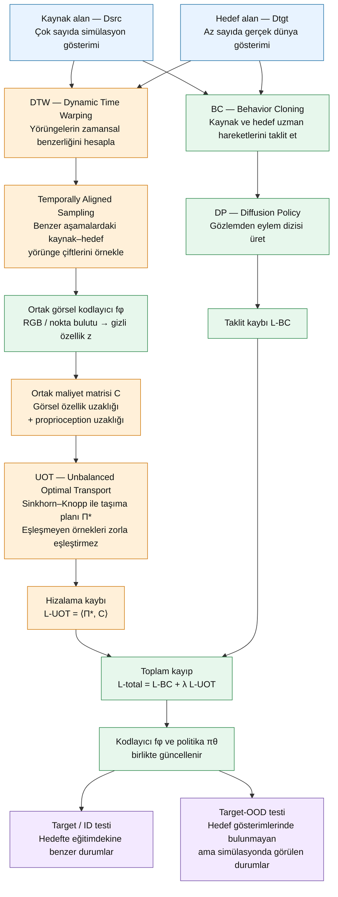
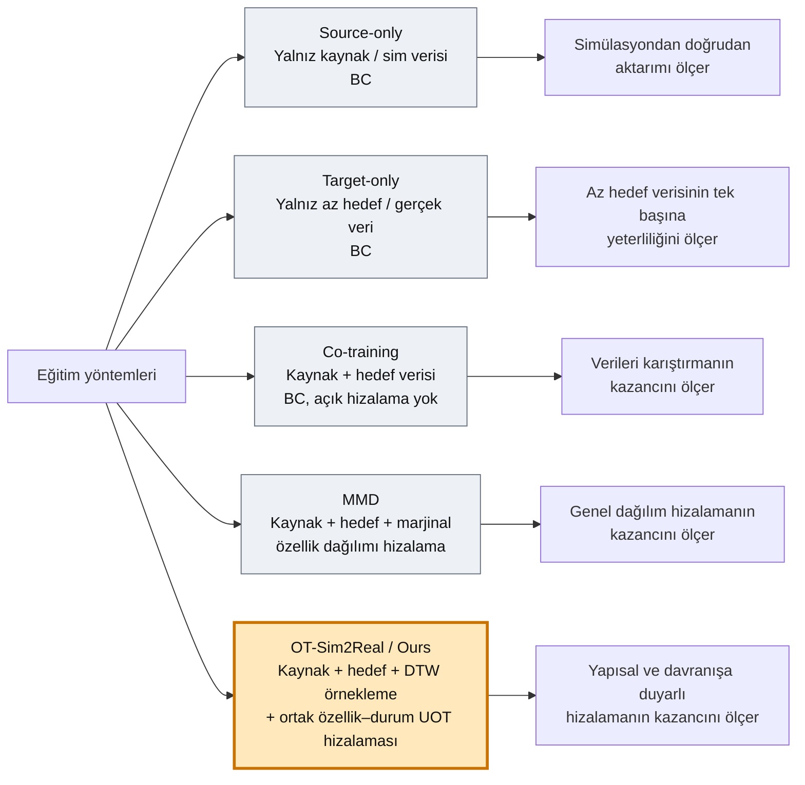

# GDA makale akışı ve yöntemler

Bu belge, **Generalizable Domain Adaptation for Sim-and-Real Policy
Co-Training** makalesindeki ana yöntemin veri akışını, kayıplarını ve karşılaştırma
yöntemlerini açıklar. Makaledeki ana yöntem deney tablolarında **Ours**, resmî
proje ve bu yeniden üretimde **OT-Sim2Real** adıyla anılır.

## Ana yöntem akışı



Akışın temel adımları şöyledir:

1. Kaynak veri simülasyondan bol miktarda, hedef veri gerçek robottan az sayıda
   elde edilir.
2. **DTW**, davranış olarak birbirine benzeyen kaynak ve hedef yörüngelerini
   belirler.
3. Zamansal örnekleyici, görevin benzer aşamalarındaki kaynak ve hedef geçişlerini
   aynı mini-batch içine getirir.
4. Ortak görsel kodlayıcı iki alanın gözlemlerini aynı gizli uzaya taşır.
5. **UOT**, benzer proprioceptive durumlara ait görsel özellikleri hizalar. Veri
   sayıları dengesiz olduğundan bütün örnekleri zorla eşleştirmez.
6. **Behavior Cloning**, uzman eylemlerini öğrenir; hizalama kaybı kodlayıcının
   görsel alan değişimine dayanıklı özellikler üretmesini teşvik eder.
7. Kodlayıcı ve politika aşağıdaki ortak amaçla birlikte güncellenir:

   `L_total = L_BC + λ × L_UOT`

8. Politika hedef alanın eğitimdekine benzer durumlarında ve hedef
   gösterimlerinde bulunmayan **OOD** durumlarında değerlendirilir.

Makalenin kuramsal anlatımı görsel özellik–eylem çiftlerinin ortak dağılımını
hizalar. Pratik uygulama, simülasyon ve gerçek robot eylem temsilleri arasındaki
farklardan etkilenmemek için eylem uzaklığı yerine robotun proprioceptive durumunu
kullanır.

## Karşılaştırılan yöntemler



| Yöntem | Eğitim verisi | Amaç / kayıp | Sorduğu soru |
|---|---|---|---|
| **Source-only** | Yalnız kaynak | BC | Simülasyon politikası doğrudan hedefe aktarılabilir mi? |
| **Target-only** | Yalnız az hedef verisi | BC | Az sayıdaki hedef gösterimi tek başına yeterli mi? |
| **Co-training** | Kaynak + hedef | BC | İki veri kümesini karıştırmak ne kazandırır? |
| **MMD** | Kaynak + hedef | BC + marjinal özellik hizalama | Genel dağılım hizalama yararlı mı? |
| **OT-Sim2Real / Ours** | Kaynak + hedef | BC + DTW destekli UOT | Yapısal ve davranışa duyarlı hizalama yararlı mı? |

MMD ile ana yöntem arasındaki temel fark, MMD'nin kaynak ve hedef özellik
dağılımlarını genel olarak yakınlaştırmasıdır. OT-Sim2Real hangi örneklerin
birbiriyle eşleşeceğini bir taşıma planıyla belirler ve bu eşleşmeyi robot durum
bilgisiyle yönlendirir.

## Kısaltmalar ve açılımları

| Kısaltma | İngilizce açılımı | Türkçe karşılığı / işlevi |
|---|---|---|
| **GDA** | Generalizable Domain Adaptation | Genellenebilir alan uyarlama |
| **BC** | Behavior Cloning | Davranış klonlama |
| **DP** | Diffusion Policy | Difüzyon tabanlı eylem politikası |
| **OT** | Optimal Transport | Optimal taşıma |
| **UOT** | Unbalanced Optimal Transport | Dengesiz optimal taşıma |
| **DTW** | Dynamic Time Warping | Dinamik zaman bükme / yörünge hizalama |
| **MMD** | Maximum Mean Discrepancy | Maksimum ortalama ayrışması |
| **OOD** | Out-of-Distribution | Eğitim dağılımı dışındaki durum |
| **ID** | In-Distribution | Eğitim dağılımına benzer durum |
| **KL** | Kullback–Leibler Divergence | UOT marjinallerini esnekleştiren dağılım farkı |

Resmî depoda `diffusion_policy_MMD` adıyla sunulan karşılaştırma yolu,
`SamplesLoss("energy")` kullanır. Bu nedenle bu yeniden üretimdeki **MMD** etiketi
makale ve resmî depo adlandırmasını izler; uygulanan hizalama terimi Energy
Distance'tır.

## Bu yeniden üretimdeki karşılığı

Makalenin genel akışında kaynak alan simülasyon, hedef alan gerçek dünyadır. Bu
yeniden üretim fiziksel robot kullanmadı; kontrollü bir simülasyondan simülasyona
görsel alan değişimi kullandı:

```text
Kaynak: normal RGB simülasyonu
   ├── down: 500 gösterim
   └── up:   500 gösterim

Hedef: table-wood simülasyonu
   ├── down: 10 eğitim gösterimi
   └── up:   0 eğitim gösterimi → ana OOD/genelleme sınaması
```

Bu nedenle `up` sonucu, hedef görünümde eğitim gösterimi bulunmayan fakat kaynak
simülasyonda öğrenilen duruma genellemeyi ölçer. Fiziksel robot sim2real sonucu
değildir.

## Kaynaklar

- [GDA makalesi — arXiv:2509.18631](https://arxiv.org/abs/2509.18631)
- [Resmî proje sayfası](https://ot-sim2real.github.io/)
- [Resmî kod — GaTech-RL2/ot-sim2real](https://github.com/GaTech-RL2/ot-sim2real)
- [Bu yeniden üretimin protokolü](../docs/PROTOCOL.md)
- [Ana sonuçlar](README.md)
